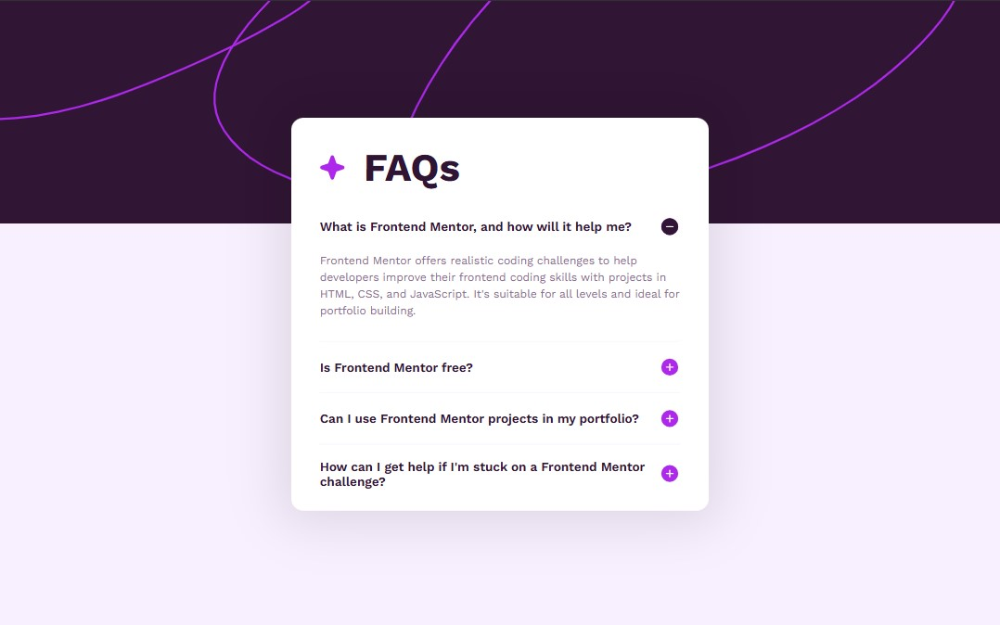
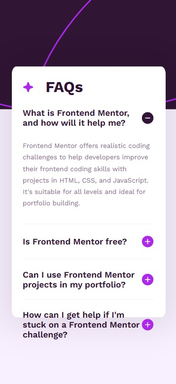

# Frontend Mentor - FAQ accordion solution

This is a solution to the [FAQ accordion challenge on Frontend Mentor](https://www.frontendmentor.io/challenges/faq-accordion-wyfFdeBwBz). Frontend Mentor challenges help you improve your coding skills by building realistic projects. 

## Table of contents

- [Overview](#overview)
  - [The challenge](#the-challenge)
  - [Screenshot](#screenshot)
  - [Links](#links)
- [My process](#my-process)
  - [Built with](#built-with)
  - [What I learned](#what-i-learned)
  - [Continued development](#continued-development)
- [Author](#author)

## Overview

### The challenge

Users should be able to:

- Hide/Show the answer to a question when the question is clicked
- View the optimal layout for the interface depending on their device's screen size
- See hover and focus states for all interactive elements on the page

### Screenshot

Desktop Design

Mobile Design

### Links

- Solution URL: [GitHub page](https://github.com/AgnerShimokawa/faq-accordion)
- Live Site URL: [Live site URL](https://agnershimokawa.github.io/faq-accordion/)

## My process

### Built with

- Semantic HTML5 markup
- CSS custom properties
- Flexbox
- CSS Grid
- JavaScript

### What I learned

With this challenge I learned how to overlap 2 elements on top of each other very easily using grid, then making the one on top as display: none and using JavaScript to switch between visible and not visible.

### Continued development

In terms of JavaScript it was a very simple challenge, so there's still a lot more work to be done, however this helped solidify some of the concepts for manipulating the DOM.
*

## Author

- GitHub - [AgnerShimokawa](https://github.com/AgnerShimokawa)
- Frontend Mentor - [@AgnerShimokawa](https://www.frontendmentor.io/profile/AgnerShimokawa)
- LinkedIn - [Agner Shimokawa](https://www.linkedin.com/in/agner-shimokawa/)